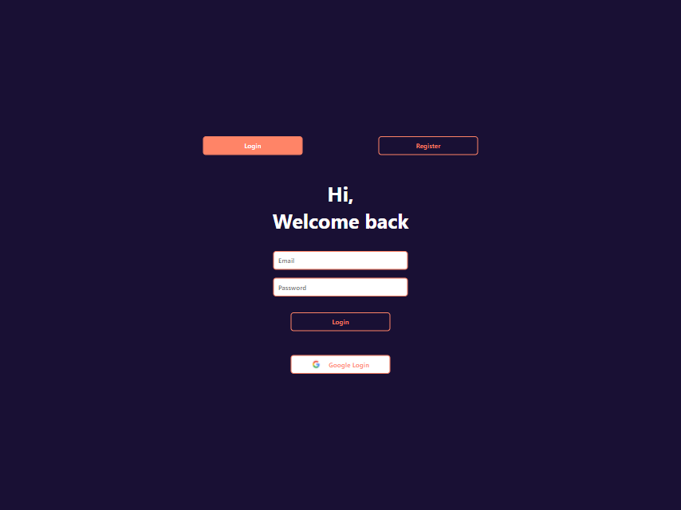

 <a href="https://login-unlu-task.web.app/" target="_blank">
  <b>Go to Firebase Login Demo Website &rarr;</b>
 </a>

  

# `Firebase Login: A Firebase Login Sample with React.Js`

⚡ A web application built with firebase login and register. With that it also have options for Google login. 🔐\
Built with few good cups of coffee ☕ and lo-fi coding music 🎵.
  
## ScreenShot

This project was bootstrapped with [Create React App](https://github.com/facebook/create-react-app).

## Available Scripts

In the project directory, these script can be executed:

### `npm start`

Runs the app in the development mode.\
Open [http://localhost:3000](http://localhost:3000) to view it in the browser.

The page will reload if you make edits.\
You will also see any lint errors in the console.

### `npm test`

Launches the test runner in the interactive watch mode.\
See the section about [running tests](https://facebook.github.io/create-react-app/docs/running-tests) for more information.

### `npm run build`

Builds the app for production to the `build` folder.\
It correctly bundles React in production mode and optimizes the build for the best performance.

The build is minified and the filenames include the hashes.\
Your app is ready to be deployed!

See the section about [deployment](https://facebook.github.io/create-react-app/docs/deployment) for more information.

### `npm run eject`

**Note: this is a one-way operation. Once you `eject`, you can’t go back!**

If you aren’t satisfied with the build tool and configuration choices, you can `eject` at any time. This command will remove the single build dependency from your project.

Instead, it will copy all the configuration files and the transitive dependencies (webpack, Babel, ESLint, etc) right into your project so you have full control over them. All of the commands except `eject` will still work, but they will point to the copied scripts so you can tweak them. At this point you’re on your own.

You don’t have to ever use `eject`. The curated feature set is suitable for small and middle deployments, and you shouldn’t feel obligated to use this feature. However we understand that this tool wouldn’t be useful if you couldn’t customize it when you are ready for it.

### `npm run storybook`

Runs the storybook in the development mode to visualise and test the UI components.\
Open [http://localhost:6006](http://localhost:6006) to view it in the browser.

### `npm run build-storybook`

Build the storybook for production to be deployed to visualise and test the UI components.\
Open [http://localhost:6006](http://localhost:6006) to view it in the browser.

### `npm run check`

Check the code with prettier.\
The actual command behind script.
`npx prettier --check .`

### `npm run format`

Format the code with prettier.\
The actual command behind script.
`npx prettier --write .`

### `npm run lint`

Check the code with eslint configurations.\
The actual command behind script.
`eslint . --fix`

### `npm run deploy`

Creates a `build` folder with production ready code and deploys it to firebase hosting.\
The actual command behind script.
`npm run build && firebase deploy`

## Setup

##### Clone/download the repository on your local machine.

    `git clone https://github.com/Souravdey777/firebase-login.git`

##### Install dependencies

    `npm install` or `yarn install`

##### Run Snap Shot from the root directory. 🚀

    `npm start` or `yarn start`

##### Run Storybook from the root directory. 🚀

    `npm run storybook` or `yarn storybook`
    
##### Alternatively you can use Gitpod

## Contribution and Support

Loved it!. ⭐ `Star the Repository` and support the project.

[Open a Pull Request](https://github.com/Souravdey777/firebase-login/pulls) or [Raise an Issue](https://github.com/Souravdey777/firebase-login/issues).

## License

📝 Distributed under the `MIT` License. See [LICENSE](https://github.com/Souravdey777/firebase-login/blob/main/LICENSE) for more information.

## Learn More about `Firebase`

To learn more about firebase authentication, check out the [Firebase Auth Documentation](https://firebase.google.com/docs/auth/)

To learn more about firebase hosting, check out the [Firebase Hosting Documentation](https://firebase.google.com/docs/hosting/)

## Learn More about `React.Js`

You can learn more in the [Create React App documentation](https://facebook.github.io/create-react-app/docs/getting-started).

To learn React, check out the [React documentation](https://reactjs.org/).

### Code Splitting

This section has moved here: [https://facebook.github.io/create-react-app/docs/code-splitting](https://facebook.github.io/create-react-app/docs/code-splitting)

### Analyzing the Bundle Size

This section has moved here: [https://facebook.github.io/create-react-app/docs/analyzing-the-bundle-size](https://facebook.github.io/create-react-app/docs/analyzing-the-bundle-size)

### Making a Progressive Web App

This section has moved here: [https://facebook.github.io/create-react-app/docs/making-a-progressive-web-app](https://facebook.github.io/create-react-app/docs/making-a-progressive-web-app)

### Advanced Configuration

This section has moved here: [https://facebook.github.io/create-react-app/docs/advanced-configuration](https://facebook.github.io/create-react-app/docs/advanced-configuration)

### Deployment

This section has moved here: [https://facebook.github.io/create-react-app/docs/deployment](https://facebook.github.io/create-react-app/docs/deployment)

### `npm run build` fails to minify

This section has moved here: [https://facebook.github.io/create-react-app/docs/troubleshooting#npm-run-build-fails-to-minify](https://facebook.github.io/create-react-app/docs/troubleshooting#npm-run-build-fails-to-minify)
